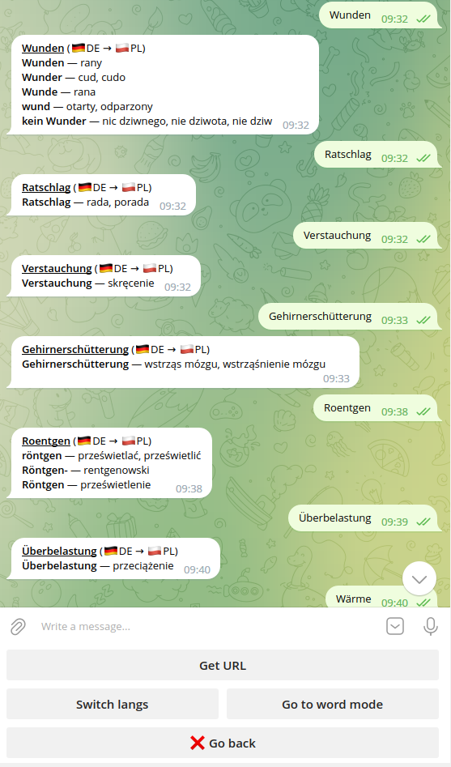

## Linuga-bot

Translate word and text right in Telegram.

 

Bot supports precision **single word translation** and every **text
translation** between **english**, **polish**, **german**, **russian**
languages

There are also features like **switching word/text mode** without losing
context and **getting URL** to translation site

Bot parses site with translations and represent information in convenient way

PS: this parser I use *only* as an alternative to visiting translations sites. I *don't* use it for commercial and I *don't* let use it to others 
